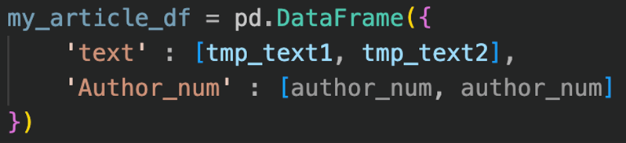
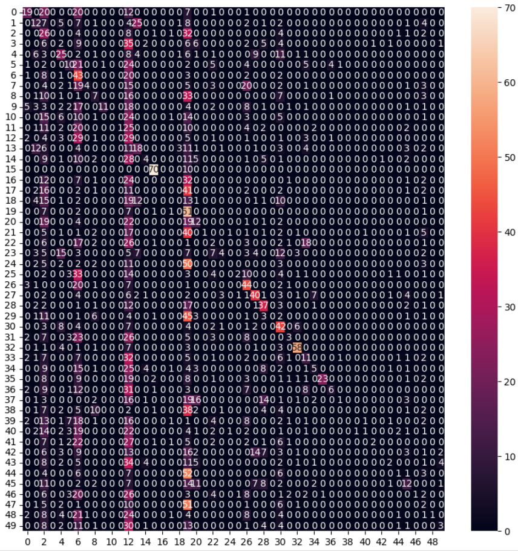

# Adversarial Attack on Authorship Identification

This project studies adversarial attack on authorship identification model in various ways.

Introduction sildes can be accessed at [here](https://www.canva.com/design/DAF3y7AtHxw/rdpKnRB2FiBPmdHh_YVvUg/view?utm_content=DAF3y7AtHxw&utm_campaign=designshare&utm_medium=link&utm_source=editor).

Adversarial Attack is the type of attack which aims to
confuse the classifier by modifying a small part of input data,
makes it barely unable to notice the modification by human
but successfully tricked the classifier. In our work, we testify the tolerance of adversarial attack on selected existing Natural Language Processing (NLP) model. We choose authorship identification classifier in our work.

We implemented five different attacking approaches, with the attack can be separated into two different phases:

- Phase 1: Confusion. In phase one, our goal is to confuse
the classifier so the modified articles should be identified
as any other authors’ creation excepts the original one.
- Phase 2: Assignment. In phase two, our goal is to make
every article being identified as articles from a specific
author.

The baseline (opponent) model can be found at [this github repo](https://github.com/arthtalati/Deep-Learning-based-Authorship-Identification/tree/master).

## Repo Structure

In main branch, our most successful approach in stored in folder *phase 1* and *phase 2* for two different phases respectively. They used the following methods:

- Phase 1: choose candidates by POS tagging with the help of `nltk` library and replace with misspelling.
- Phase 2: use enhanced TF-IDF to filter out candidates and use Genetic Algorithm (GA) to optimize our result.

As for other three different branches, they represent three different attempts with the following naming rule:

$$(\text{method to select candidates to be replaced}) / (\text{method to find alternatives for replacing candidates})$$

## Setup

For attacking models in main branch, we built those models on *Kaggle*. The information about our *Kaggle* enviroment and some brief guides is on 
[https://www.kaggle.com/datasets/sheridanm551/fast-using-lstm-model-steps]( https://www.kaggle.com/datasets/sheridanm551/fast-using-lstm-model-steps).

By using the environment and datasets we've built on *Kaggle*, both models should able to execute by running the `.ipynb` file.

As for other branches, the files in those branches should be able to build the model under python environment. Details about each approaches are listed below.

#### Phase 2

1.	The two files, `train.csv` and `test.csv`, are the files from the model which is our attack goal.
2.	From TF-IDF part, we can get the important words for the 20th author who has the most important words. `import_words_20.csv` contains the important words for the 20th author.
3.	The file, `model.pt`, is the model which we want to attack.
4.	`change_tfidf()` can be used to replace the words in a text to be the words in `import_words_20.csv` .
5.	`model_evaluate()` can be used to evaluate the model we attack. That is to say, we use `model_evaluate()` to know which author will be identified for a given text. The input of this function is a dataframe, like the following image.
 
6.	`similarity_cal()` can be used to calculate the similarity between the two given texts.
7.	`generate_initial()` can be used to generate at most 5 modified texts from 1 original text. The at most 5 modified texts can be the initial generation of genetic algorithm.
8.	The time to generate the initial generation for the 500 texts is costly. We can store the initial generation into a csv file. 
9.	`fitness()` will provide the fitness of a text.
10.	`crossover()` will generate a child text from two parents texts.
11.	`mutation()` will generate a mutated text from a given text.
12.	`selection()` will generate will the top n texts from a list of given texts.
13.	Use the above 4 functions and `generate_initial()` to build up genetic algorithm.
14.	Use `similarity_cal()` and `model_evaluate()` to get the similarity and the identified authors of the final generation of genetic algorithm.

#### Enhanced TF-IDF module

1.	`compute_idf` is for calculating the original normal IDF.
2.	`compute_idf_for_author` is for calculating the *IDF_d* in improved IDF part.
3.	`compute_author_frequent_word_level` is for calculating the *IDF_c* in improved IDF part.

#### grad/Glove

1. Baseline model is stored in `opponent_model/baseline.pt`
2. Some specific datasets for this branch is stored in `used_dataset` folder.
3. The preprocessing part can be skipped. Start from the cell before *Utilizing Datafields* to use our provided dataset directly.
4. `AuthorClassifier()` defines the model of baseline model, we use this to retrieve the parameters of baseline model.
5. `train_classifier()` and `evaluate_classifier()` is for training and inferencing with the model respectively.
6. `create_replacement()` is the function to find candidates to be replaced. In this branch, we use gradients in the model to select candidates. For other approaches, please check out other branches.
7. After `attack_iterator` is generated, `evaluate_classifier()` can be executed to get the heatmap of classification result.

#### grad/BERT

1. Baseline model is stored in `opponent_model/baseline.pt`
2. Some specific datasets for this branch is stored in `used_dataset` folder. Some shared dataset is located under the same folder in `grad/Glove` branch.
3. `BERT.ipynb` is for fine tuning the BERT model for Masked Language Modeling (MLM). 
4. After the bert model is generated, `Articel_level_grad_BERT.ipynb` can be executed.
5. The preprocessing part can be skipped. Start from the cell before *Utilizing Datafields* to use our provided dataset directly.
6. `evaluate_classifier()` is used to calculate the attacking result on original classifier. This will generate the final heatmap.

#### grad/TF-IDF and TF-IDF/TF-IDF

1. Baseline model is stored in `opponent_model/baseline.pt`
2. Some specific datasets for this branch is stored in `used_dataset` folder. Some shared dataset is located under the same folder in `grad/Glove` branch.
3. For `TF-IDF.ipynb`, [guidelines](#enhanced-tf-idf-module) mentioned above can be referenced.
4. The preprocessing part can be skipped. Start from the cell before *Utilizing Datafields* to use our provided dataset directly.
5. `evaluate_classifier()` is used to calculate the attacking result on original classifier. This will generate the final heatmap.

## Attacking Result

All attacking result is included in each branches for each approaches. It should be a heatmap looks like the picture below:

This is the graphical attacking result for phase 1 attack. Check out files in each folders for more detailed information.

## Contribution

Thanks for the co-authorship from W. -P. Lin, T. -Y. Liu, Z. -W. Hong, H. -L. You, and T. -Y. Hsieh.

